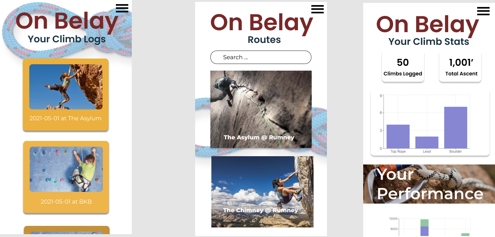

# On Belay

This is the front end of a Personal Climbing Tracker app. This app is meant to allow climbers to track their progress as they get better at the sport. It also is a place to record "beta" for yourself so you can remember your climbs and what you did to achieve them.

Technologies Used:
`React`
`Node.Js`
`Recharts`
`Flask`
`Python`
`Peewee`

----
## User Stories:
### General 
- As a Climber, I want to be able to track my progress as I get better at the sport and achieve long term goals 
- As a user, I want to remember my past climbs. 

### Tracking a climb:
- As a climber I want to be able to make a log of a climb and the salient data points that will haelp me track my progress over time 
    - data points include: climb type, height, rating, my performance, gym or outdoor, my time(?), the type of wall it was, a picture and any notes

### See my logs
- I want to be able to see all of my logged climbs in one place 
- I want to be able to click into a log to see what information I recorded

### Reporting
- I want to be able to navigate to a personal dashboard that shows me stats of my climbing career
- on a givent route I would like to see stats about my progress on that route, such as toal times attempted and a timeline of attempts stacked by performance 

### Routes
- routes can be established by anyone and I would like to make a log against an established route (public)
- I can also create private routes 
- Public Routes can have comments and ratings from users 

### STRETCH
- route pages include a map
- you can share your stats or a climb log (export them to social media)
- you can view someones profile (and dashboard)

----
## Data 

### Users
Users are each individual climber - they can log a climb, see/create a route, have a profile
users have logs, users have routes
```
    username=CharField(unique=True)
    email=CharField(unique=True)
    password=CharField()
    display_name=CharField()
    description=CharField()
    is_admin=BooleanField()
    created=DateTimeField(default=datetime.datetime.now)
```

### Routes
users create routes, routes have logs, routes have comments and ratings
users have many routes
```
    name=CharField(unique=True)
    location=CharField()
    description=Charfield()
    image=BigBitField()
    created=DateTimeField(default=datetime.datetime.now)
    creator=ForeignKeyField(User, backref='my_routes')
```
(if routes have multiple images there might need to be an images table...)

### Climb Logs
users create logs on a route (users have many logs, routes have many logs) 
```
    image=BigBitField()
    created=DateTimeField(default=datetime.datetime.now)
    creator=ForeignKeyField(User, backref='my_climbs')
    route=ForeignKeyField(Route, backref='route_climbs')
    notes=CharField()
    climb_type=CharField()
    height=IntegerField()
    rating=CharField()
    performance=CharField()
    gym_outdoor=CharField()
    time=DecimalField()
    wall_type=CharField()
```

----
## Wire Frame

